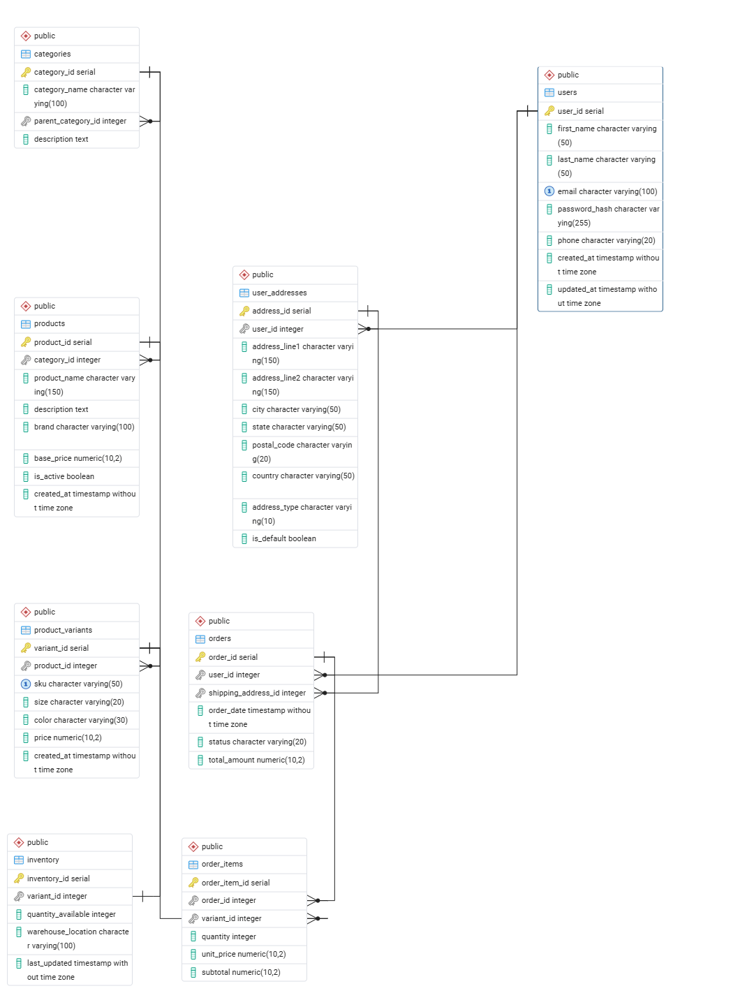

# Ecommerce_Database
# E-Commerce Database Design

A relational database schema for an e-commerce platform, built in PostgreSQL as a college database systems project. Covers user accounts, product catalog with variants, inventory tracking, and order management.

## Tech stack

- **PostgreSQL** (developed and tested using pgAdmin)

## Entity-relationship diagram



## Schema overview

| Table | Purpose |
|---|---|
| `Users` | Registered customer accounts |
| `User_Addresses` | Shipping/billing addresses linked to a user |
| `Categories` | Product categories, supports nested sub-categories |
| `Products` | Base product info (name, brand, category) |
| `Product_Variants` | Size/color/SKU-level variants of a product |
| `Orders` | Customer orders, linked to a shipping address |
| `Order_Items` | Line items within an order, referencing a specific variant |
| `Inventory` | Stock quantity per variant, one row per variant |

**Design notes:**
- `Product_Variants` is separate from `Products` because a single product (e.g. a T-shirt) can have multiple purchasable variants (size/color combos), each with its own SKU, price, and stock level.
- `Categories` is self-referencing (`parent_category_id`) to support sub-categories (e.g. Electronics → Mobile Phones).
- `Inventory` has a one-to-one relationship with `Product_Variants` — every variant has exactly one stock record.

## Project structure

```
.
├── README.md
├── sql query.sql   -- table definitions + sample INSERT statements
└── schemas.jpg     -- ER diagram screenshot
```

## Setup

1. Create a new database in pgAdmin (or via `psql`):
   ```sql
   CREATE DATABASE ecommerce;
   ```
2. Connect to it and run the SQL file to create all tables and load the sample data:
   ```
   \i "sql query.sql"
   ```
   (Or in pgAdmin: open `sql query.sql` in the Query Tool while connected to the `ecommerce` database, then execute.)
3. Verify the tables were populated:
   ```sql
   SELECT * FROM Products LIMIT 5;
   ```

## Sample data

The sample dataset includes:
- 8 users with addresses
- 10 categories (with parent/sub-category relationships)
- 40 products across 9 categories
- 74 product variants (sizes/colors)
- Matching inventory records
- 15 sample orders with order line items

## Author

*(Your name here)*
*(Course name / instructor, if relevant)*

## License

*(Optional — add a license if you plan to make this repo public, e.g. MIT)*
